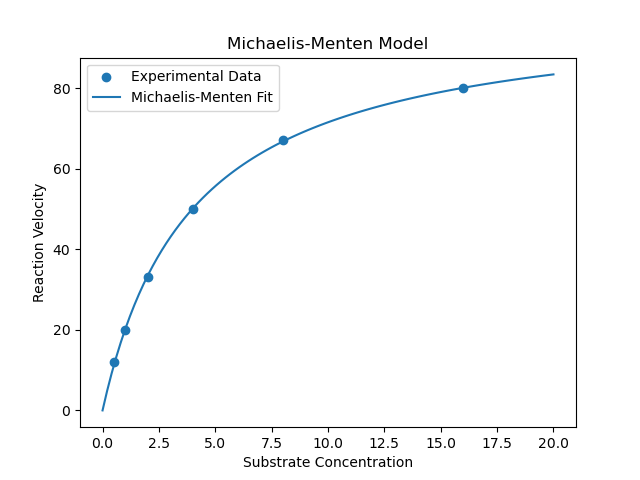

# enzyme_kinetic_modelling
Michaelis-Menten enzyme kinetics modeling and parameter estimation using Python.

# Enzyme Kinetics Modeling

## Project Overview

This project implements the Michaelis-Menten enzyme kinetics model using Python and nonlinear regression.

The objective was to estimate key kinetic parameters from experimental enzyme-substrate data and evaluate model performance.

## Methods

* Data visualization using Matplotlib
* Nonlinear curve fitting using SciPy
* Parameter estimation of:

  * Vmax (maximum reaction velocity)
  * Km (Michaelis constant)
* Model evaluation using R² score

## Results

| Parameter | Estimated Value |
| --------- | --------------- |
| Vmax      | 100.01          |
| Km        | 3.98            |
| R²        | 0.9997          |

## Biological Interpretation

The fitted model accurately captured enzyme saturation behavior.

* Vmax indicates the maximum catalytic rate achievable under substrate saturation.
* Km ≈ 4 suggests half-maximal velocity is reached at approximately 4 substrate units.
* The high R² value demonstrates excellent agreement between the model and experimental observations.

## Technologies Used

* Python
* Pandas
* NumPy
* Matplotlib
* SciPy
* Scikit-learn

## Future Improvements

* Compare multiple enzymes
* Incorporate experimental noise
* Extend to inhibition kinetics
* Perform confidence interval estimation
